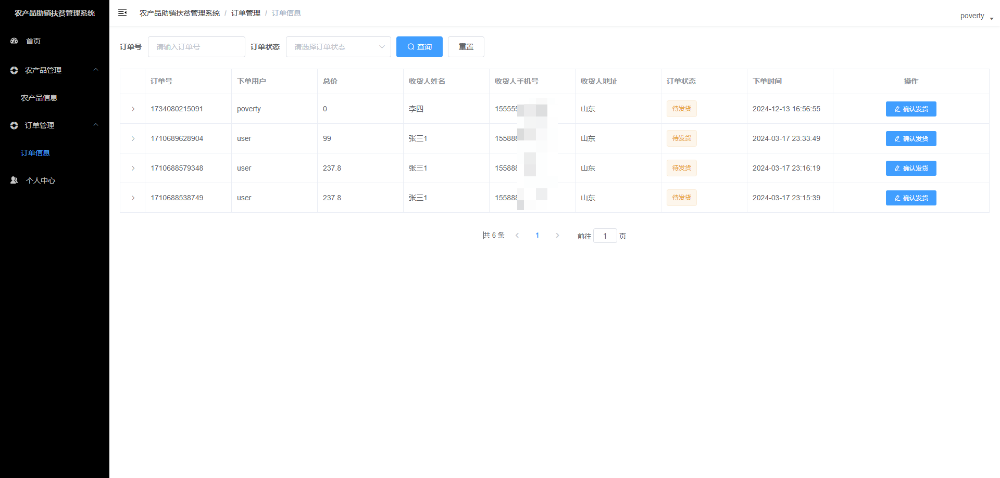

# 基于Java+SpringBoot+Vue农产品助销扶贫平台(源码+数据库)

#### 作者QQ：3275035005 微信：xkbishe123 (支持修改、 部署调试、 代做接毕业设计和课程设计)

#### 网站建设、小程序、H5、APP、各种系统、样式修改、10000套源码可选。

#### 选题+开题报告+任务书+程序定制+安装调试+论文+答辩ppt 都可以做

#### 问题包修改，包满意，有需求尽管甩过来！一条龙帮你安心过！

#### 所有项目以及源代码本人均调试运行无问题 可支持远程调试运行

# 项目介绍
基于Java+SpringBoot+Vue农产品助销扶贫平台-毕业设计，本系统分为三个角色用户、贫困户、管理员项目采用前后端分离开发。

可选题目：农产品助销扶贫平台、农产品助销扶贫管理系统

### 1. 用户

用户登录、用户注册、查看轮播图、查看公告、查看扶贫资讯、查看扶贫政策、查看扶贫项目、查看推荐优质农产品、查看农产品、农产品加入购物车、购物车结算、查看我的订单、我的收藏农产品、个人信息修改、查看贫困户申请、申请留贫困户、查看扶贫项目、申请扶贫项目、退出登录 

### 2. 贫困户

登录、农产品管理、订单管理、个人信息修改、退出登录

### 3. 管理员

登录、公告管理、扶贫资讯管理、扶贫政策管理、农产品管理、农产品分类管理、贫困户管理、贫困户审核、扶贫项目管理、扶贫项目审核、订单管理、用户信息管理、贫困户信息管理、密码修改、个人信息修改、退出登录 

# 技术框架
- 开发语言：Java
- 数据库：Mysql5.7以上
- 系统环境：jdk8、maven、node
- 后端框架：SpringBoot、MyBatis
- 前端框架：Vue、ElementUI
- 工具：IDEA、Navicat
- 技术架构：前后端分离、B/S架构、MVC架构
# 项目截图

### 1. 用户端

### 2. 贫困户端

### 3. 管理员端

